# BetterAltTab_Unnamed10110

A modern, lightweight, and highly customizable Alt+Tab replacement for Windows, written in C++ with pure Win32 API. Designed for power users who want a beautiful, fast, and feature-rich window switcher with persistent Z-order, pinning, search/filter, and more.

---

## 🚀 Features

- **Modern Alt+Tab Overlay**: Beautiful, resizable, rounded-corner overlay with OLED black theme and transparency.
- **Live Window Thumbnails**: See real-time previews of all open windows, just like Windows 11/10 Alt+Tab.
- **Persistent Z-Order Mode**: Pin and reorder windows; your custom order persists across sessions and Explorer restarts.
- **Quick Actions**: Close, pin, and move-to-position actions for each window, accessible via mouse or keyboard.
- **Keyboard Shortcuts**:
  - `Ctrl+NumpadDot` or `Alt+Q`: Open overlay, cycle selection, release modifier to focus selected window.
  - Number keys (1-9, 0): Instantly select and focus the corresponding window.
  - Arrow keys, Tab, Enter, Esc: Full keyboard navigation and dismissal.
- **Pin to Position**: Use the `#` button to pin a window to a specific position in the persistent order.
- **OLED Black Theme**: Overlay and popups use a true black background for perfect OLED displays.
- **Minimal Dependencies**: Pure Win32 API, no Qt/.NET/third-party frameworks.
- **Super Fast**: Instant overlay, no lag, optimized for large numbers of windows.

---

## 🖥️ How to Use

### Hotkeys
- **Open Overlay**: `Ctrl+NumpadDot` or `Alt+Q`
- **Cycle Selection**: Keep holding the modifier and press the hotkey again
- **Select by Number**: Press `1`-`9` or `0` (for 10th) to instantly select/focus a window
- **Navigate**: Use arrow keys, Tab, or mouse
- **Close Overlay**: Release the modifier, press `Esc`, or click outside

### Quick Actions (on hover)
- **Close**: Click the `X` icon
- **Pin/Unpin**: Click the pin icon
- **Pin to Position**: Click the `#` icon, enter a number, press Enter

---

## 🛠️ Build Instructions

### Prerequisites
- Windows 10/11 (x64)
- Visual Studio 2019/2022 or MSVC toolchain
- CMake 3.10+

### Steps
1. Clone the repository:
   ```sh
   git clone <your-repo-url>
   cd BetterAltTab_Unnamed10110
   ```
2. Configure and build:
   ```sh
   cmake -S . -B build
   cmake --build build --config Release
   ```
3. Run:
   ```sh
   build/Release/BetterAltTab_Unnamed10110.exe
   ```

---

## ⚙️ Configuration & Customization
- **Persistent Z-Order**: Window order and pin state are saved in `grid_order.bin`.
- **Overlay Size**: Defaults to 88% screen width, 80% height; resizable at runtime.
- **Theme**: OLED black by default; easily customizable in `main.cpp`.
- **Hotkeys**: Change in `main.cpp` (`RegisterHotKey` calls).
- **Ignored Files**: See `.gitignore` for build and temp files.

---

## 🧩 Technical Details
- **Language**: C++17, pure Win32 API
- **Thumbnails**: Uses DWM API (`DwmRegisterThumbnail`)
- **Virtual Desktops**: Uses `IVirtualDesktopManager` COM interface
- **Overlay**: Layered, rounded, double-buffered window with transparency
- **Persistence**: Custom binary format for window order and pin state
- **Input Handling**: Full keyboard and mouse support, including hotkeys and search
- **Performance**: Double-buffered GDI, minimal flicker, optimized for many windows

---

## 🌟 Strong Points
- **Blazing Fast**: Instant overlay, no lag, even with 50+ windows
- **No Bloat**: No Qt, .NET, or heavy dependencies
- **Modern Look**: Rounded corners, transparency, OLED black, smooth UI
- **Power User Features**: Pinning, persistent order, search, keyboard shortcuts, quick actions
- **Portable**: Single EXE, no installer needed
- **Open Source**: Easily hackable and extensible

---

## 🖼️ Modern Overlay Mockup

```mermaid
flowchart TD
    subgraph Overlay[BetterAltTab_Unnamed10110 Overlay]
        direction LR
        T1["<b>1</b>\n[Icon]\nWindow Title\n[Pin] [#] [X]"]
        T2["<b>2</b>\n[Icon]\nWindow Title\n[Pin] [#] [X]"]
        T3["<b>3</b>\n[Icon]\nWindow Title\n[Pin] [#] [X]"]
        T4["..."]
    end
    style Overlay fill:#111,stroke:#00FF44,stroke-width:2px,color:#fff
    style T1 fill:#222,stroke:#50b4ff,stroke-width:2px
    style T2 fill:#222,stroke:#50b4ff,stroke-width:2px
    style T3 fill:#222,stroke:#50b4ff,stroke-width:2px
    style T4 fill:#222,stroke:#888,stroke-width:1px
```



---

## 📝 License
MIT (or your preferred license)

---

## 🙏 Credits
- Inspired by Windows 11 Alt+Tab, PowerToys, and the open-source community.
- Contact: Unnamed10110 - trojan.v6@gmail.com / sergiobritos10110@gmail.com

---

## 💬 Feedback & Contributions
Pull requests, issues, and suggestions are welcome! 